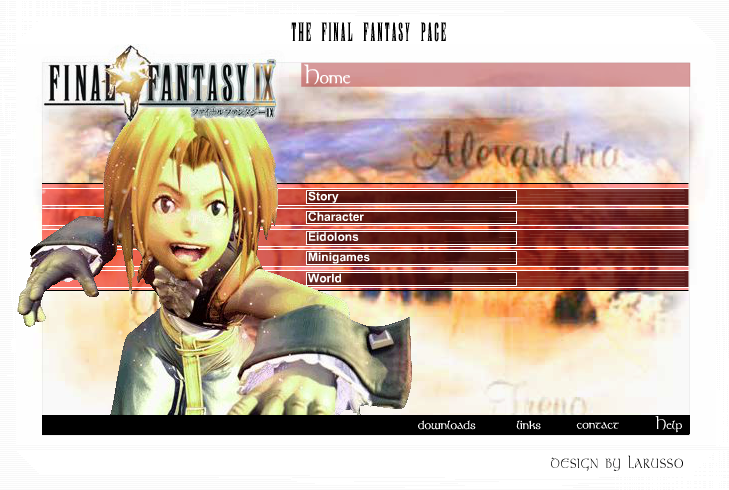

# Final-Fantasy IX

This repository contains my first big Adobe Flash project from 2002-2003. It's a fanpage for the PSX game **Final Fantasy IX**.

I lost all my `.fla` and `.psd` files over the years so I can only show the compiled version of the page. Maybe I can grab one of my old decompiler versions and run it over all the `.swf` files.

You can visit it here: [final-fantasy-IX] (http://larusso.github.io/final-fantasy-IX/)

## the project
I used to be and still am a big fan of the Final Fantasy franchise. The later games did not have such a heavy impact as the old ones but still. I started working on this side somewhat during 2002 and 2003. My plan was to create a big fansite completely written in Flash with subsides for all Final Fantasy Games. I managed to create two sites and started 3 others before I left the project alone.

### software used
I build this whole thing with Macromedia Flash 5. I used mainly Action Script 1 but had no idea what it is at that time. The Flash Scripting Editor helped me a lot. Most of the time I used the command `tellTarget`. It's one of the first commands introduced in Flash 4. The project is written with timeline scripts and animations.

### lazy what?
Back in the day when websites used to be very static and the only way of getting some movement done was using flash, most flash pages had the annoying habit of packing everything in one big `.swf` file. You entered the page and saw a minute long loading animation. I hated this and wanted to give the visitors of my page a nicer user experience.

So I splited everything up in multiple `.swf` files and loaded them at runtime with the Flash 4 command `loadMovie`. I had no idea that flash was able to load also the content at runtime, so I created each content `.swf` file by hand. For each `.swf` file there was a `.fla` file. I had to be sure not to change the layout/design of this object.

### content
I created most of the screenshots, icons, texts on my own. I played the game on my tv and switched the connection to a TV-Card whenever I found a new `Chocobo mini game` secret or a Moogle letter. Only the card stats I ripped from a different site.

---

I had a lot of fun doing this website and since Flash will have its last day in a couple of month/years I wanted to save my work for the future here.
 
